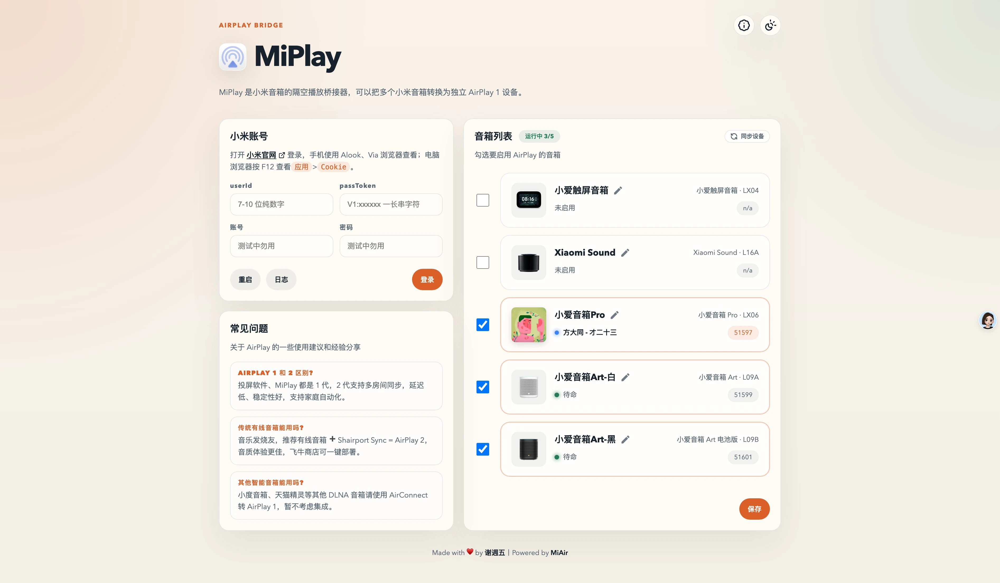
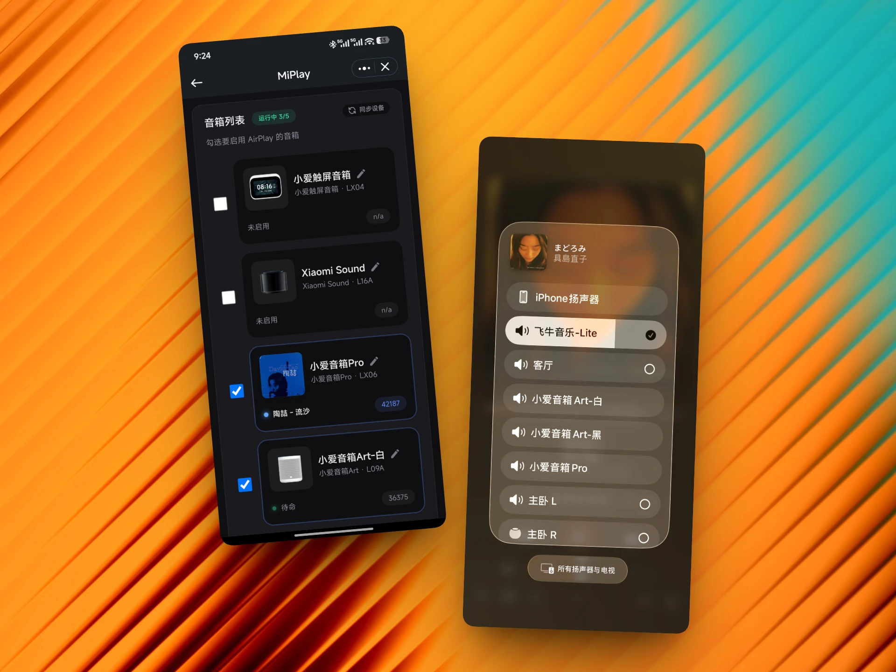

# MiPlay

MiPlay 是一个小米音箱的 AirPlay 无线桥接器，可以把多个小米音箱一次性转发成多个独立的 AirPlay 设备。
> 本项目参考并整合了[MiAir](https://github.com/KiriChen-Wind/MiAir)、[miservice-fork](https://pypi.org/project/miservice-fork/)、[AirPlay2-Receiver](https://github.com/openairplay/airplay2-receiver)、[XiaoMusic](https://github.com/hanxi/xiaomusic)等项目的思路与部分实现，面向自用场景进行了重构。




## ✨ 功能特色

- 小米音箱注册独立 AirPlay 设备
- 支持 x86、arm64 架构
- 可与 `Shairport-Sync`搭配使用，一台设备同时支持有线和无线 AirPlay 音箱
    - 小米无线音箱（方便）：MiPlay ➡️ 无线 AirPlay 1
    - 传统有线音箱（专业）：Shairport-Sync ➡️ 有线 AirPlay 2 多房间


## 🚀 部署方式

### 1、Docker Compose
```
services:
  miplay:
    image: ghcr.io/juneix/miplay
    # image: docker.1ms.run/juneix/miplay  # 毫秒镜像加速
    container_name: miplay
    network_mode: host
    restart: unless-stopped
    environment:
      WEB_PORT: 8300
    volumes:
      - ./conf:/app/conf
# 如需搭配 Shairport-Sync 使用，请取消注释
#  shairport-sync:
#    image: mikebrady/shairport-sync
#    container_name: airplay2
#    network_mode: host
#    restart: always
#    devices:
#      - /dev/snd:/dev/snd
#    cap_add:
#      - SYS_NICE
```


### 2、飞牛应用

飞牛商店的【AirPlay - 隔空播放】即将整合 MiPlay。


## ❤️ 支持项目

- 打赏鼓励：支持我开发更多有趣应用
- 互动群聊：加入 💬 [QQ 群](https://qm.qq.com/q/ZzOD5Qbhce) 可在线催更
- 更多内容：访问 ➡️ [谢週五の藏经阁](https://5nav.eu.org)

<div align="center">
  <table>
    <tr>
      <td align="center">
        <br/>
        <sub>微信</sub>
      </td>
      <td align="center">
        <br/>
        <sub>支付宝</sub>
      </td>
    </tr>
  </table>
</div>